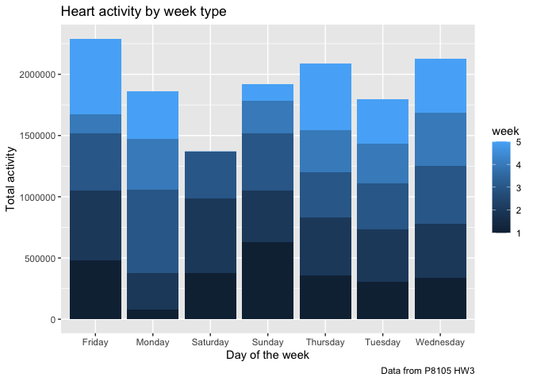
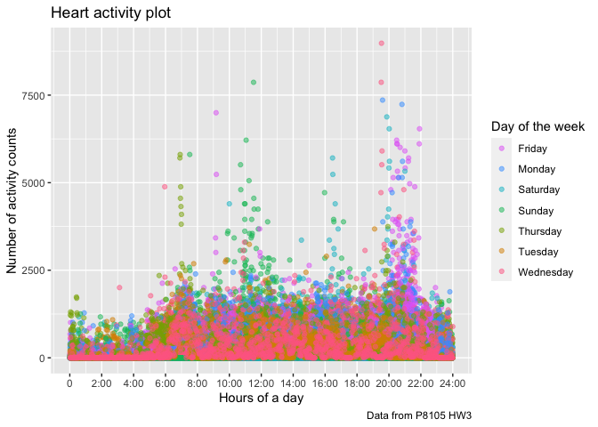
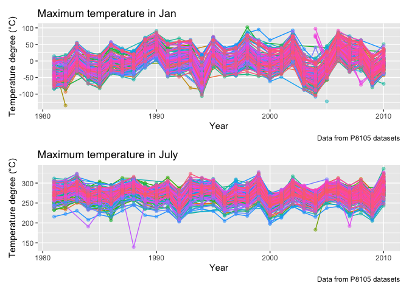
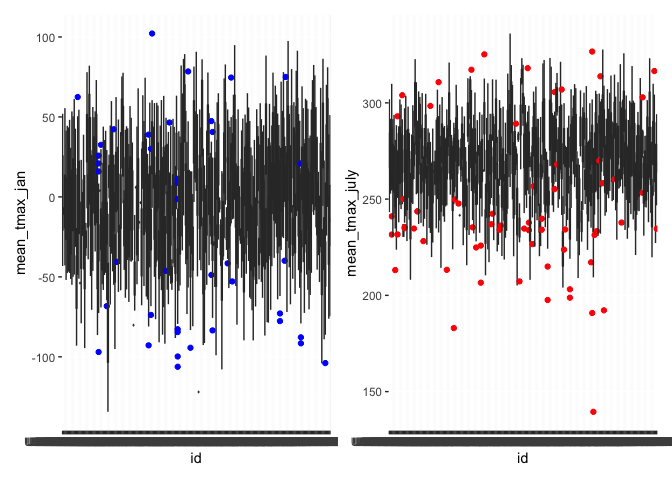

p8105_hw3_cn2604
================
2022-10-07

# Problem 2

The dataframe after cleaning processes has 6 variables and 50400
observations. It includes the week and day variables with an indication
of either weekday or weekend. Each one minute interval is turned into a
variable named activity_number and activity_counts is the new variable
for original activity data.

| week | day       | total_activity |
|-----:|:----------|---------------:|
|    1 | Friday    |         480542 |
|    1 | Monday    |          78828 |
|    1 | Saturday  |         376254 |
|    1 | Sunday    |         631105 |
|    1 | Thursday  |         355923 |
|    1 | Tuesday   |         307094 |
|    1 | Wednesday |         340115 |
|    2 | Friday    |         568839 |
|    2 | Monday    |         295431 |
|    2 | Saturday  |         607175 |
|    2 | Sunday    |         422018 |
|    2 | Thursday  |         474048 |
|    2 | Tuesday   |         423245 |
|    2 | Wednesday |         440962 |
|    3 | Friday    |         467420 |
|    3 | Monday    |         685910 |
|    3 | Saturday  |         382928 |
|    3 | Sunday    |         467052 |
|    3 | Thursday  |         371230 |
|    3 | Tuesday   |         381507 |
|    3 | Wednesday |         468869 |
|    4 | Friday    |         154049 |
|    4 | Monday    |         409450 |
|    4 | Saturday  |           1440 |
|    4 | Sunday    |         260617 |
|    4 | Thursday  |         340291 |
|    4 | Tuesday   |         319568 |
|    4 | Wednesday |         434460 |
|    5 | Friday    |         620860 |
|    5 | Monday    |         389080 |
|    5 | Saturday  |           1440 |
|    5 | Sunday    |         138421 |
|    5 | Thursday  |         549658 |
|    5 | Tuesday   |         367824 |
|    5 | Wednesday |         445366 |

<!-- --> No
apparent trend could be found by the table but the bar plot above
suggests that Saturday has least total activity compared to other days
of the week.

<!-- -->
The graph shows that the heart activity rates are highest between 10am
to 12pm and 8pm to 10pm throughout the week. The patient seems to have
more stable heart activity in Tuesday and Wednesday though he has
reached his highest activity rate in Wednesday, which exceeds 7500
activity counts per minute. Overall, the patient maintains an activity
rate way below 2500 per minute in most time of a day.

# Problem 3

The raw dataframe of ny_noaa has 7 variables and 2595176 observations.
It has weather station id, date of observation, precipitation, snowfall,
snow depth, and maximum and minimum temperatures. For data of
precipitation, snowfall, and snow depth, there are 145838, 381221,
591786 missing values. For tmax and tmin, 1134358 and 1134420 of the
observations are missing, which loss about a half of helpful information
for further analysis.

1.  While most of the observations for snowfall are missing, 0 mm is the
    most commonly seen value in the remaining observation. It is
    reasonable because snowfall is an occasional event in that area and
    no snow should be observed in normal days.

<!-- --> The
scatterplots for maximum temperatures shows that most of the observed
maximum temperature in January across all weather station is between -50
to 50 degree Celsius while the range is between 250 to 300 degree
Celsius in July. Though outliers are hard to be visualized by the
scatterplots above, they can be found by the boxplots in the below
marked in blue and red.

<!-- -->
