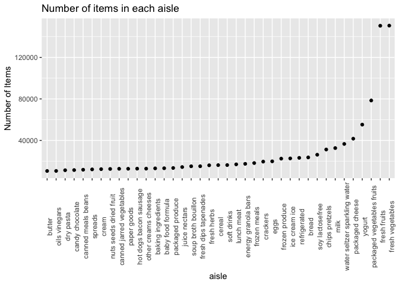
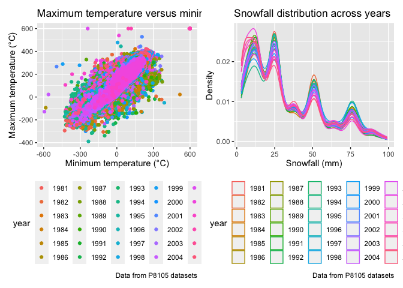

p8105_hw3_cn2604
================
2022-10-07

# Problem 1

This dataset contains 1384617 rows and 15 columns. Variables are
inventories for users and order lists. The product names and order time
are also recorded. There are 39123 products in 131209 orders from 131209
different users.

<!-- --> Here is a
table for baking ingredients, dog food care, and packaged vegetables
fruits.

| aisle                      | product_name                                  |    n | rank |
|:---------------------------|:----------------------------------------------|-----:|-----:|
| packaged vegetables fruits | Organic Baby Spinach                          | 9784 |    1 |
| packaged vegetables fruits | Organic Raspberries                           | 5546 |    2 |
| packaged vegetables fruits | Organic Blueberries                           | 4966 |    3 |
| baking ingredients         | Light Brown Sugar                             |  499 |    1 |
| baking ingredients         | Pure Baking Soda                              |  387 |    2 |
| baking ingredients         | Cane Sugar                                    |  336 |    3 |
| dog food care              | Snack Sticks Chicken & Rice Recipe Dog Treats |   30 |    1 |
| dog food care              | Organix Chicken & Brown Rice Recipe           |   28 |    2 |
| dog food care              | Small Dog Biscuits                            |   26 |    3 |

Finally is a table for mean hour of the day at Pink Lady Apples and
Coffee Ice Cream.

| product_name     |     0 |     1 |     2 |     3 |     4 |     5 |     6 |
|:-----------------|------:|------:|------:|------:|------:|------:|------:|
| Coffee Ice Cream | 13.77 | 14.32 | 15.38 | 15.32 | 15.22 | 12.26 | 13.83 |
| Pink Lady Apples | 13.44 | 11.36 | 11.70 | 14.25 | 11.55 | 12.78 | 11.94 |

# Problem 2

``` r
acce_df = read.csv("./data/accel_data.csv") %>% 
  janitor::clean_names() %>% 
  pivot_longer(
    activity_1:activity_1440,
    names_to = "activity_number",
    names_prefix = "activity_",
    values_to = "activity_counts"
  ) %>% 
  mutate(
    activity_number = as.numeric(activity_number),
    week_type = factor(case_when(
      day %in% c("Monday", "Tuesday", "Wednesday", "Thursday", "Friday") ~ "weekday",
      day %in% c("Saturday", "Sunday") ~ "weekend",
      TRUE ~ "unknown"
      )
    ),
    .after = day
  )

day_df = acce_df %>% 
  group_by(week, day) %>% 
  summarize(
    total_activity = as.integer(sum(activity_counts))
  )
```

The dataframe after cleaning processes has 6 variables and 50400
observations. It includes the week and day variables with an indication
of either weekday or weekend. Each one minute interval is turned into a
variable named activity_number and activity_counts is the new variable
for original activity data.

``` r
knitr::kable(day_df)
```

| week | day       | total_activity |
|-----:|:----------|---------------:|
|    1 | Friday    |         480542 |
|    1 | Monday    |          78828 |
|    1 | Saturday  |         376254 |
|    1 | Sunday    |         631105 |
|    1 | Thursday  |         355923 |
|    1 | Tuesday   |         307094 |
|    1 | Wednesday |         340115 |
|    2 | Friday    |         568839 |
|    2 | Monday    |         295431 |
|    2 | Saturday  |         607175 |
|    2 | Sunday    |         422018 |
|    2 | Thursday  |         474048 |
|    2 | Tuesday   |         423245 |
|    2 | Wednesday |         440962 |
|    3 | Friday    |         467420 |
|    3 | Monday    |         685910 |
|    3 | Saturday  |         382928 |
|    3 | Sunday    |         467052 |
|    3 | Thursday  |         371230 |
|    3 | Tuesday   |         381507 |
|    3 | Wednesday |         468869 |
|    4 | Friday    |         154049 |
|    4 | Monday    |         409450 |
|    4 | Saturday  |           1440 |
|    4 | Sunday    |         260617 |
|    4 | Thursday  |         340291 |
|    4 | Tuesday   |         319568 |
|    4 | Wednesday |         434460 |
|    5 | Friday    |         620860 |
|    5 | Monday    |         389080 |
|    5 | Saturday  |           1440 |
|    5 | Sunday    |         138421 |
|    5 | Thursday  |         549658 |
|    5 | Tuesday   |         367824 |
|    5 | Wednesday |         445366 |

``` r
ggplot(day_df, aes(x = day, y = total_activity, fill = week)) +
  geom_bar(stat = "identity") +
  labs(
    title = "Heart activity by week type",
    x = "Day of the week",
    y = "Total activity",
    caption = "Data from P8105 HW3")
```

<!-- -->

No apparent trend could be found by the table but the bar plot above
suggests that Saturday has least total activity compared to other days
of the week.

``` r
acce_df %>% 
  ggplot(aes(x=activity_number, y=activity_counts, color = day)) + 
  geom_point(alpha = .5) + 
  scale_x_continuous(
    breaks = seq(0, 1440, 120),
    labels = c("0", "2:00", "4:00", "6:00","8:00","10:00", "12:00", "14:00", "16:00", "18:00", "20:00", "22:00", "24:00")
  ) +
  scale_color_hue(name = "Day of the week", h = c(300, 0)) +
  labs(
    title = "Heart activity plot",
    x = "Hours of a day",
    y = "Number of activity counts",
    caption = "Data from P8105 HW3")
```

<!-- -->

The graph shows that the heart activity rates are highest between 10am
to 12pm and 8pm to 10pm throughout the week. The patient seems to have
more stable heart activity in Tuesday and Wednesday though he has
reached his highest activity rate in Wednesday, which exceeds 7500
activity counts per minute. Overall, the patient maintains an activity
rate way below 2500 per minute in most time of a day.

# Problem 3

``` r
data("ny_noaa")
```

The raw dataframe of ny_noaa has 7 variables and 2595176 observations.
It has weather station id, date of observation, precipitation, snowfall,
snow depth, and maximum and minimum temperatures. For data of
precipitation, snowfall, and snow depth, there are 145838, 381221,
591786 missing values. For tmax and tmin, 1134358 and 1134420 of the
observations are missing, which loss about a half of helpful information
for further analysis.

1.  While most of the observations for snowfall are missing, 0 mm is the
    most commonly seen value in the remaining observation. It is
    reasonable because snowfall is an occasional event in that area and
    no snow should be observed in normal days.

``` r
jan_tmax = noaa_df %>% 
  filter( month == "01") %>% 
  select(id, year, tmax) %>% 
  na.omit() %>% 
  mutate(
    year = as.numeric(year)
    ) %>%
  group_by(id, year) %>% 
  summarize(
    mean_tmax_jan = mean(tmax)
  )

july_tmax = noaa_df %>% 
  filter( month == "07") %>% 
  select(id, year, tmax) %>% 
  na.omit() %>% 
  mutate(
    year = as.numeric(year)
    ) %>% 
  group_by(id, year) %>% 
  summarize(
    mean_tmax_july = mean(tmax)
  )
```

``` r
jan_tmax_p = 
  jan_tmax %>% 
  ggplot(aes(x=year, y=mean_tmax_jan, group=id, color = id)) + 
  geom_line() +
  geom_point(alpha=.5) +
  labs(
    title = "Maximum temperature in Jan",
    x = "Year",
    y = "Temperature degree (°C)",
    caption = "Data from P8105 datasets") +
  theme(legend.position = "none") 

july_tmax_p = 
  july_tmax %>% 
  ggplot(aes(x=year, y=mean_tmax_july, group=id, color = id)) + 
  geom_line() +
  geom_point(alpha=.5) +
  labs(
    title = "Maximum temperature in July",
    x = "Year",
    y = "Temperature degree (°C)",
    caption = "Data from P8105 datasets") +
  theme(legend.position = "none") 

jan_tmax_p / july_tmax_p
```

<!-- -->

2.  The spaghetti plots for maximum temperatures shows that most of the
    observed maximum temperature in January across all weather station
    is between -50 to 50 degree Celsius while the range is between 250
    to 300 degree Celsius in July. Outliers could be found on the points
    which are above 100 and below -100 in the plot for Jan, points below
    200 could be found in the plot for July.

``` r
tmax_tmin = 
  noaa_df %>% 
  ggplot(aes(x=tmin, y=tmax)) + 
  geom_point(aes(color=year)) +
  labs(
    title = "Maximum temperature versus minimum temperature",
    x = "Minimum temperature (°C)",
    y = "Maximum temperature (°C)",
    caption = "Data from P8105 datasets") +
  theme(legend.position = "bottom") 

snow_den =
  noaa_df %>% 
  filter(snow_mm > 0 & snow_mm < 100) %>% 
  ggplot(aes(x=snow_mm, color = year)) +
  geom_density(alpha=.5) +
  labs(
    title = "Snowfall distribution across years",
    x = "Snowfall (mm)",
    y = "Density",
    caption = "Data from P8105 datasets") +
  theme(legend.position = "bottom") 

tmax_tmin + snow_den
```

<!-- -->

3.  Two figures above are tmax vs tmin for the full dataset and snowfall
    distribution between 0 to 100 mm across the years.
